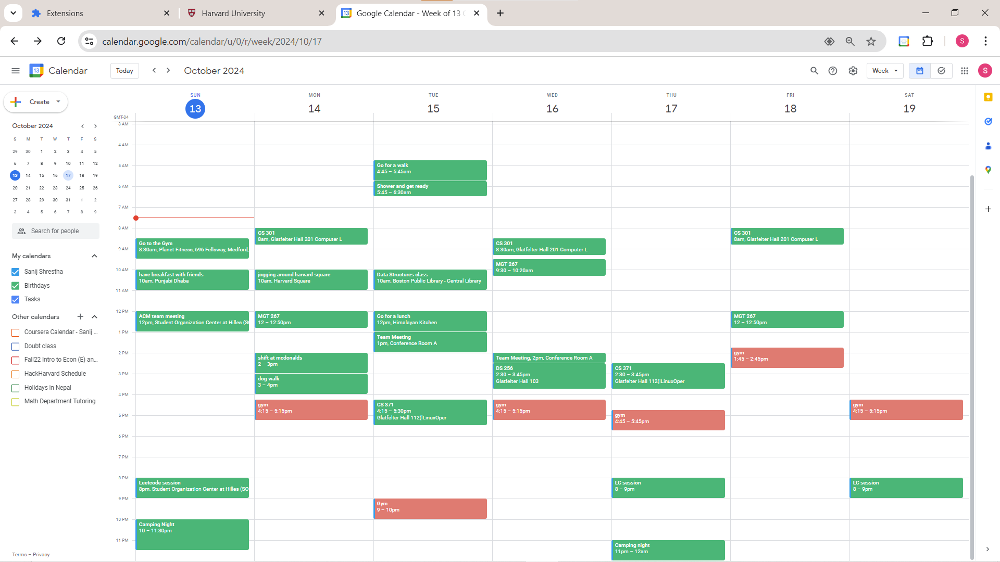

## Inspiration
We created Climately to change how people plan their days. Imagine being able to see real-time weather information right next to your schedule! By combining these features, we want to boost productivity and help users make better daily decisions, no matter the weather.

The best part? There’s no need to switch to an entirely new calendar; it effortlessly integrates as an extension of Google Calendar, one of the most popular calendars available, enhancing your experience without any hassle.

## What it does
Easily see your events with real-time weather updates and personalized scheduling suggestions. This helps you plan outdoor activities better and stay prepared for any weather surprises.

## How we built it
Our Chrome extension delivers real-time weather updates directly to your browser, offering quick, accurate forecasts and alerts without the need for external websites.

We chose React for the front end because it makes development easier and helps us create a dynamic user experience. Now, for authentication, we use Google OAuth, allowing users to send their Google Calendar schedules and preferences to the backend, which they can easily adjust in the extension.

Our technology stack is designed to create a seamless user experience, with Java Spring Boot powering the backend. We handle multiple APIs to ensure smooth integration, allowing weather-related events to be directly added to your calendar. We dynamically update these events using the Weather API and Google Calendar API. We utilize the OpenAI API for intelligent AI suggestions, evaluating whether to offer recommendations based on weather conditions and user event context, and providing options like rescheduling or alternative plans.

We’re hosting our backend on Digital Ocean, and we have exciting plans to launch our Chrome extension on the Chrome Web Store (currently under review), making it accessible to everyone!

## Challenges we ran into
We encountered challenges with Google authentication and sending data to the backend from our extension, which involved navigating some complexities. Since this was our first time building a Google Chrome extension, we also had difficulties with data storage on local devices because of permission restrictions.

On the backend, we encountered issues with intricate network processes that frequently caused our API calls to crash. We worked hard to fix these problems, which improved our application's stability and performance.

Despite these challenges, we persevered and built a product we are proud of.

## Accomplishments that we're proud of
We take great pride in our innovative idea, which modernizes calendar applications that have long needed an update. The seamless integration with Google Calendar ensures ease of use, eliminating the need for users to switch to a different platform.

We are also proud of overcoming the numerous challenges we encountered throughout development, particularly in combining multiple APIs and synchronizing the frontend with the backend—a task that is no simple feat.

## What we learned
Working with the OpenAI API and Google authentication taught us how to integrate advanced features into our app, significantly enhancing its functionality and user experience. Additionally, we navigated the exciting challenge of building and deploying browser extensions, which was a new venture for us.

We encountered several issues with HTTP server ports, but we’re proud to say that troubleshooting these problems deepened our understanding of how they operate. Our mentors played a crucial role during this process, guiding us through various challenges and helping us maintain composure while resolving issues. Their support not only improved our problem-solving skills but also made our development journey more enjoyable.

Many hurdles had to be overcome to orchestrate the front-end, Calendar, Weather, and Open AI APIs to provide a seamless and reliable experience. Effective use of documentation, Hackathon resources (mentors, workshops), and effective use of AI dev tools were key to the successful completion of the project.

## What's next for Climately?
We’re thrilled to announce our upcoming launch on the Chrome Web Store, making the Climately App accessible to a wider audience! We're also focused on introducing new exciting customizable preferences that empower users to personalize notifications and weather insights to fit their unique lifestyles!

